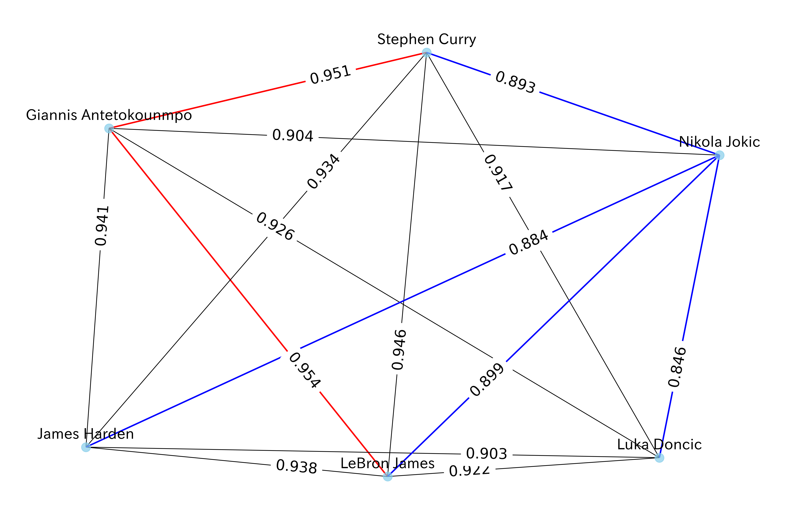

# NBA Network

[](https://opensource.org/licenses/Apache-2.0)
<a target="_blank" href="https://cookiecutter-data-science.drivendata.org/">
    
</a>

NBA Network Analysis and Machine Learning.  
e.g. train the relationships between players and predict the chemistry between players who have never been teammates.


## Blog
- [dev.to](https://dev.to/seaturt1e/predicting-nba-player-chemistry-using-graph-neural-networks-2j2f)
- [Zenn](https://zenn.dev/sea_turt1e/articles/2410af8823e6bd) *Japanese only

## Environment
```
python 3.12.7
macOS
```

## Installation
```
pip install -r requirements.txt
pip install -e .
```

## Players Chemistry Network
Predict players who have never been on the same team before and have good chemistry.

### pipeline script
You can run the pipeline script.
```
sh scripts/player_chemistry/pipeline_player_chemistry_by_assist.sh
```

### pipeline steps
- download the data
- preprocess the data
- train the model
- predict the players who have never been on the same team before and have good chemistry.
- visiualize the network of common players who have good chemistry.

### network visualization
You will get the image of the network visualization of the players who have good chemistry like below.  

  

Description:
- player nodes: playerName_hisDraftYear_hisDraftPick
- <span style="color: red; ">Red edges</span>: players who could have high chemistry.
- black edges: players who could have medium chemistry.
- <span style="color:#0066FF;">Blue edges</span>: players who could have low chemistry.

#### Caution
The default graph visualization uses the model saved at `models/gnn_model_assist_best.pth`.  
It might result in an overfitted model or underfitted model.  
You can change the model by changing the model path in the script.
Also, you can change the threshold of the edge color by changing the threshold value in the script.  
(threshold_high: 0.90, threshold_low: 0.85. threshold values are between 0 and 1.)
```
sh scripts/player_chemistry/plot/plot_common_player_relation_network_by_assist.sh \
--model-path models/gnn_model_assist_{num_epoch}.pth \
--threshold-high {threshold_high} \
--threshold-low {threshold_low}
```

## Project Organization

```
├── LICENSE            <- Open-source license if one is chosen
├── Makefile           <- Makefile with convenience commands like `make data` or `make train`
├── README.md          <- The top-level README for developers using this project.
├── data
│   ├── external       <- Data from third party sources.
│   ├── interim        <- Intermediate data that has been transformed.
│   ├── processed      <- The final, canonical data sets for modeling.
│   └── raw            <- The original, immutable data dump.
│
├── docs               <- A default mkdocs project; see www.mkdocs.org for details
│
├── models             <- Trained and serialized models, model predictions, or model summaries
│
├── notebooks          <- Jupyter notebooks. Naming convention is a number (for ordering),
│                         the creator's initials, and a short `-` delimited description, e.g.
│                         `1.0-jqp-initial-data-exploration`.
│
├── pyproject.toml     <- Project configuration file with package metadata for 
│                         nbanetwork and configuration for tools like black
│
├── references         <- Data dictionaries, manuals, and all other explanatory materials.
│
├── reports            <- Generated analysis as HTML, PDF, LaTeX, etc.
│   └── figures        <- Generated graphics and figures to be used in reporting
│
├── scripts            <- Scripts to run the pipeline 
│
├── requirements.txt   <- The requirements file for reproducing the analysis environment, e.g.
│                         generated with `pip freeze > requirements.txt`
│
├── setup.cfg          <- Configuration file for flake8 
│
└── nbanetwork   <- Source code for use in this project.
    │
    ├── modeling                <- Scripts to train models and then use trained models to make predictions
    │
    ├── dataset                 <- Scripts to download or generate data
    │
    ├── __init__.py             <- Makes nbanetwork a Python module
    │
    ├── config.py               <- Store useful variables and configuration
    │
    ├── features.py             <- Code to create features for modeling
    │   
    ├── utils.py                <- Utility functions
    │
    └── plots.py                <- Code to create visualizations
```

--------

## Data Sources
- [NBA Database](https://www.kaggle.com/datasets/wyattowalsh/basketball): CC BY-SA 4.0
- [NBA Players](https://www.kaggle.com/datasets/justinas/nba-players-data)


